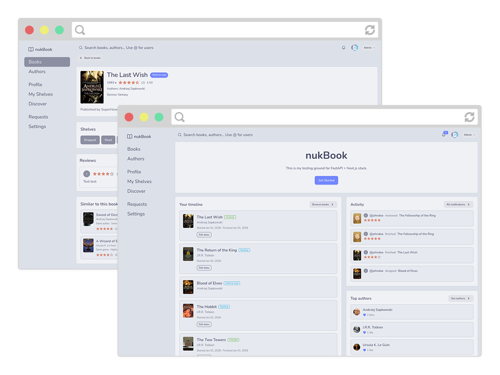

<h1 align="center" style="margin-top:0;">nukBook</h1>

Goodreads inspired social book-focused app with reviews, shelves, and discovery.
Used as excuse to test drive FastAPI + Next.js stack.

## Stack

- Web: Next.js (App Router), React, TypeScript, Tailwind CSS, pnpm
- API: FastAPI, SQLAlchemy, Alembic, Pydantic
- DB: Postgres
- Dev/ops: Docker Compose, Traefik (local routing)

## What it does

- Browse books and authors with detail pages and media
- Live search across books, authors and users
- Track reading status and organize books into shelves
- Write reviews, leave ratings, and followed users see activity feeds
- Follow users, manage requests, and view notifications
- Discover recommendations, genres, and tags
- Compare taste with friends to see similarity, agreements, and recommendations
- Admin views for managing books, authors, users, reviews, tags, and genres

## Getting started

1. `docker compose up --build`
2. Open `https://nukbook.local.dev` (web) and `https://api-nukbook.local.dev` (API)

Copy `.env.example` to `.env` to customize database, JWT, and URL settings.
If you are not using Traefik locally, update the hosts and `WEB_ORIGIN`/`NEXT_PUBLIC_API_URL` values in `docker-compose.yml`.
